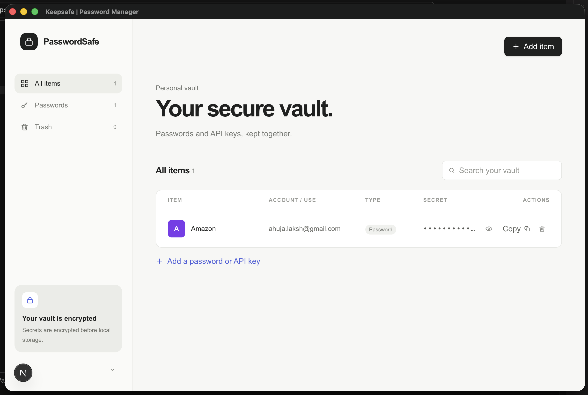
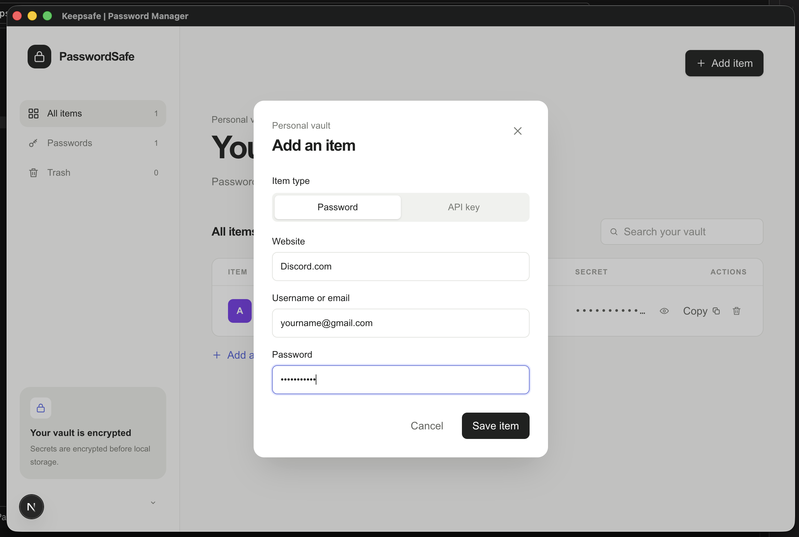
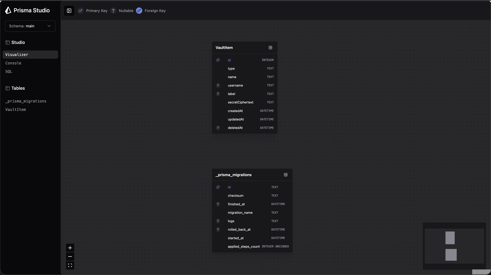
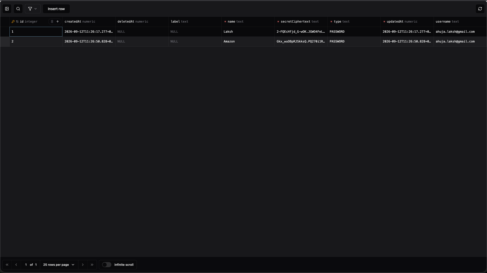
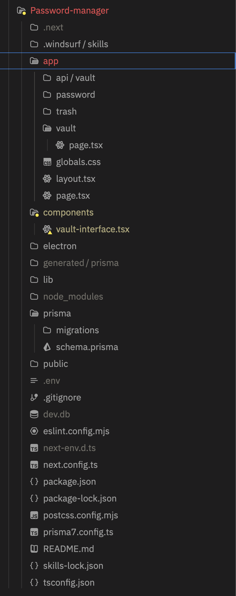

# Password-manager-using-Electron

[](https://nextjs.org/)
[](https://www.electronjs.org/)
[](https://www.typescriptlang.org/)
[](https://www.prisma.io/)
[](https://tailwindcss.com/)


This project is a desktop password manager built with Next.js and Electron for securely managing passwords and API keys in one place. It provides a clean interface for organizing, viewing, and managing sensitive credentials. The application combines a modern Next.js frontend with Electron to deliver a cross-platform desktop experience. It also uses Prisma for database management and persistent storage.

## Features

- 🔐 Password management
- 🔑 API key management
- 🗂️ Organized password vault
- 🗑️ Trash/deleted items management
- 💾 Local SQLite database
- 🖥️ Desktop application using Electron
- 🗄️ Prisma ORM for database management

## Images:

<p align="center">
  
</p>

<p align="center">
  
</p>

## How to start the password manager

```bash
1) npm install
2) npm install prisma @prisma/client @prisma/adapter-better-sqlite3 dotenv
3) npm install prisma@latest @prisma/client@latest @prisma/adapter-better-sqlite3@latest
4) npm install -D @types/better-sqlite3
5) npm install --save-dev prisma@7.10.0 --save-exact
6) npm install @prisma/client@7.10.0 --save-exact
7) npx prisma generate
8) npx prisma migrate deploy
9) npm install electron concurrently cross-env wait-on
```

Run the server:

```bash
cd Password-manager
npm run dev
```

## How to start prisma studio: 

```text
npx prisma studio --url="file:///(File directory)/password-manager/dev.db"
```

<p align="center">
  
</p>

<p align="center">
  
</p>


## .env file contents (add this to the .env which was created by the initialization commands)
```text
DATABASE_URL="file:./dev.db"
VAULT_ENCRYPTION_KEY="YOUR_ENCRYPTION_KEY"
```

## Database structure

<p align="center">
  
</p>

The project follows a modular Next.js App Router architecture, separating UI components, application routes, API endpoints, database logic, and desktop functionality into dedicated folders. This keeps the codebase organized, maintainable, and easier to scale.

<b>app/vault — </b> Contains the main password-vault interface/page where users can view and manage their stored credentials. <br>
<b>app/api/vault — </b> Contains the backend API routes responsible for handling vault-related operations such as retrieving, creating, updating, or deleting credentials. <br>
<b>electron/ — </b> Contains the Electron configuration and desktop-process code that wraps the Next.js application into a desktop application. <br>
<b>prisma/ — </b> Contains the Prisma database schema and migration files used to define and manage the application's database structure. <br>


